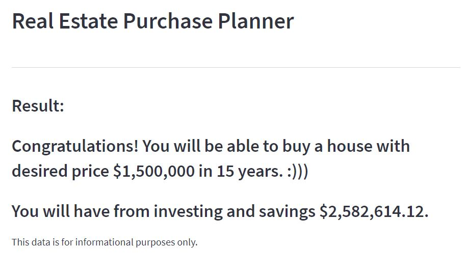

# Real Estate Purchase Planner for the U.S.


## Description

The aim of the project is to forecast clients’ portfolios to determine when they can afford real estate at their desired price. Based on user input, the app examines the clients' portfolios (i.e., savings, cryptocurrency, stocks, bonds) and the down payment they are willing to pay.
The app utilizes the Monte Carlo simulation to project clients’ portfolios, and it uses the future value equation to project the real estate market. These analyses will allow the application to tell the client in how many years they can afford a house at their desired price.

---

## Technologies

This project uses the standard Python 3.8 libraries and requires the following libraries and dependencies:

```
os
pandas
requests
streamlit
dotenv
alpaca_trade_api
datetime
dateutil.relativedelta
PIL
Monte Carlo simulation script (from MCForecastTools import MCSimulation)
```

The app utilizes APIs:

1. [Alpaca API](https://alpaca.markets) - for pulling stocks, bonds and crypto historical prices
2. [Alternative](https://alternative.me/crypto/api/) - for pulling real time crypto prices
3. [Rapid API - Zillow](https://rapidapi.com/apimaker/api/zillow-com1/) - for pulling housing data

---

## Installation Guide

To run the application, first complete the following steps:

**Option 1 - Running locally:**

1. Clone the repository: `git clone https://github.com/VladislavGlupak/Real-Estate-Purchase-Planner.git`

2. Create an Alpaca API and Rapid API account to obtain your own set of "keys":
   
   [Alpaca API](https://alpaca.markets/)

   [Rapid API](https://rapidapi.com/)

3. Add your keys to the "sample.env" file:
   ```
   ALPACA_API_KEY = "YOUR_KEY"
   ALPACA_SECRET_KEY = "YOUR_KEY"
   RAPIDAPI_KEY = "YOUR_KEY"
   ```
   Then, change the name of the file to ".env" (the file should disappear)

4. Install Streamlit: `pip install streamlit`

5. Type this code into your terminal to run the app in a web browser: `streamlit run app.py` (Make sure to run it from the folder that contains the "app.py" file!)
```
Any other needed dependencies are provided in the "environment.yml"
```

**Option 2 - Running in the cloud:**

1. Fork the repository from this link: [GitHub](https://github.com/VladislavGlupak/Real-Estate-Purchase-Planner)

2. Add your keys to the "sample.env" file:
   ```
   ALPACA_API_KEY = "YOUR_KEY"
   ALPACA_SECRET_KEY = "YOUR_KEY"
   RAPIDAPI_KEY = "YOUR_KEY"
   ```
   Then, change the name of the file to ".env" (the file should disappear)

3. Create a [Streamlit](https://streamlit.io/) account

4. Go to the Streamlit [Share](share.streamlit.io) page to connect to the app 
```
Any other needed dependencies are provided in the "environment.yml"
```

## Usage - Overview 

1. To determine how many years it will take to afford a house or at least a down payment on your desired house price, go to the Streamlit web link via your local machine: `streamlit run app.py`
   
2. Read the questions in the side bar on the left and enter your information

3. Review the results. You can toggle the portfolio risk level to see if a higher portfolio risk level allows you to afford the house and/or down payment on the house sooner

## Methods

The Monte Carlo simulation is used to predict the approximate earnings from investments and savings. To see how this method works, please review the "MCForecastTools.py" script.

## Usage - In Depth 

1. The user answers the questions found in the left sidebar of the app:


2. After that, the user has to wait until the calculation finishes


3. As a result of the calculation, the user will see a message with a "Congratulations" or a "Sorry" message



4. As additional information, the user will see a map and a table with the current houses offered in the desired city

On the map:


On the table:


---

## Contributers

Vladislav Glupak - [GitHub](https://github.com/VladislavGlupak)

Catherine Croft - [GitHub](https://github.com/ccroft6)

Amanda Hum - [GitHub](https://github.com/amandahum18)

Magdalena Švimberská - [GitHub](https://github.com/MagdaSvim)

Thomas Brierton - [GitHub](https://github.com/ThomasBrierton)

---

## License

MIT
